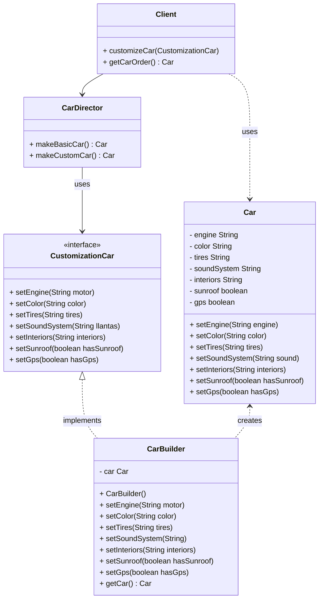
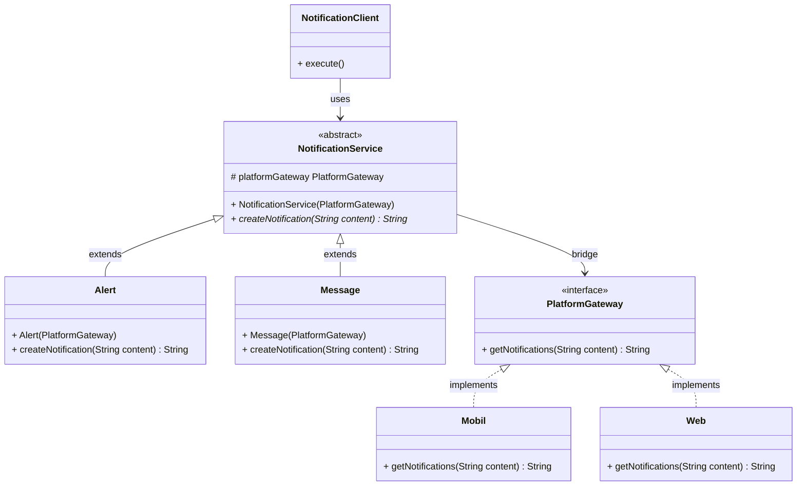

# sabana-design-pattern
Actividad 1: Diplomado universidad de La Sabana - Patrones  de diseño.

# Integrantes
- Alexy Yesenia Rincón Capera
- Harver Andrey Cordero Duarte
- Juan Sebastian Joya Rodriguez
- Karen Ximena Orozco Gamboa

## Escenario 1: Sistema de Personalización Automotriz

### Descripción del Escenario
Desarrollo de una aplicación para una compañía automotriz que permite a los clientes personalizar y ordenar un automóvil. Un objeto Automóvil puede tener múltiples configuraciones opcionales:
- Tipo de motor
- Color
- Llantas
- Sistema de sonido
- Interiores
- Techo solar
- Navegación GPS

### Problema Identificado
Crear un objeto Automóvil con múltiples configuraciones puede llevar a:
- **Constructor telescópico**: constructores multi parámetros.
- **Múltiples constructores sobrecargados**: dificultad en mantenimiento y legibilidad del código.

### Patrón de Diseño Aplicado: **CREACIONAL - PATRÓN BUILDER**

### ¿Por qué Builder Pattern?

**El Patrón Builder es la solución ideal para este escenario ¿por qué?:**

1. **Resuelve el problema del constructor telescópico**: En lugar de tener un constructor con n parámetros, el patron Builder permite configurar el objeto, en este caso el automovil, paso a paso, añadiendo tantas personalizaciones como sean requeridas.

2. **Cumple con los beneficios esperados**:
   - ✅ **Legibilidad y claridad**: Construcción fluida y expresiva
   - ✅ **Inmutabilidad**: El objeto Car final es inmutable una vez construido
   - ✅ **Flexibilidad**: Atributos opcionales sin múltiples constructores
   - ✅ **Separación de construcción y representación**: La lógica de construcción está en CarBuilder, separada de la clase Car

3. **Características del patrón que coinciden con el problema**:
   - **Construcción compleja**: El automóvil tiene múltiples componentes opcionales.
   - **Configuraciones variables**: Diferentes combinaciones de características.
   - **Proceso paso a paso**: Cada característica se configura individualmente.
   - **Producto final inmutable**: Una vez construido, el objeto Car no se modifica.

### Implementación en el Proyecto
- **Producto**: `Car.java` - El automóvil final
- **Builder Interface**: `CustomizationCar.java` - Define los pasos requeridos de construcción de un objeto Car.
- **Builder Concreto**: `CarBuilder.java` - Implementa la construcción paso a paso para el auto en cuestión.
- **Director**: `CarDirector.java` - Orquesta el proceso de construcción del objetotipo Car.

### Diagrama de Clases Escenario 1 (Patrón Builder)

## Escenario 2: Sistema de Notificaciones Multiplataforma

### Descripción del Escenario
Desarrollo de una aplicación que gestiona la visualización de notificaciones en diferentes plataformas (escritorio, móvil, web). Las notificaciones pueden ser de distintos tipos (mensaje, alerta, advertencia, confirmación) y cada tipo puede mostrarse de distintas formas según la plataforma.

### Problema Identificado
Si se utiliza herencia tradicional, se tendría que crear clases como:
- NotificacionMensajeWeb, NotificacionAlertaWeb
- NotificacionMensajeMovil, NotificacionAlertaMovil
- Esto lleva rápidamente a una explosión combinatoria de subclases difíciles de mantener.

### Patrón de Diseño Aplicado: **ESTRUCTURAL - PATRÓN BRIDGE**

### ¿Por qué un patrón Bridge ?

**El Patrón Bridge es la solución ideal para este escenario ¿por qué?:**

1. **Evita la explosión combinatoria**: En lugar de crear N×M clases (N tipos de notificación × M plataformas), el patrón Bridge separa las dos jerarquías (Abstracción e implementación), permitiendo que evolucionen de forma independiente.

2. **Cumple con los beneficios esperados**:
   - ✅ **Separación de responsabilidades**: La lógica de la notificación se separa del medio por el cual  se representa.
   - ✅ **Escalabilidad**: Permite agregar  facilmente nuevas plataformas o tipos de  notificaciones sin modificar el resto del sistema.
   - ✅ **Reducción de clases**: Evita la multiplicación de clases para cada combinaciones  posibles.
   - ✅ **Flexibilidad en tiempo de ejecución**: Permite un cambio dinámico de plataforma, en c aso tal de ser requerido.

3. **Características del patrón que coinciden con el problema**:
   - **Dos dimensiones de variación**: Tipos de notificación y plataformas de presentación.
   - **Independencia de evolución**: Ambas jerarquías pueden crecer sin afectar la otra.
   - **Composición sobre herencia**: Usa delegación en lugar de herencia múltiple.

### Implementación en el Proyecto
- **Abstraction**: `NotificationService.java` - Define la interfaz de alto nivel para notificaciones.
- **Refined Abstractions**: `Alert.java`, `Message.java` - Tipos específicos de notificación.
- **Implementor**: `PlatformGateway.java` - Interface para las plataformas.
- **Concrete Implementors**: `Mobil.java`, `Web.java` - Implementaciones específicas por plataforma.

### Diagrama de Clases Escenario 2 (Patrón Bridge)

